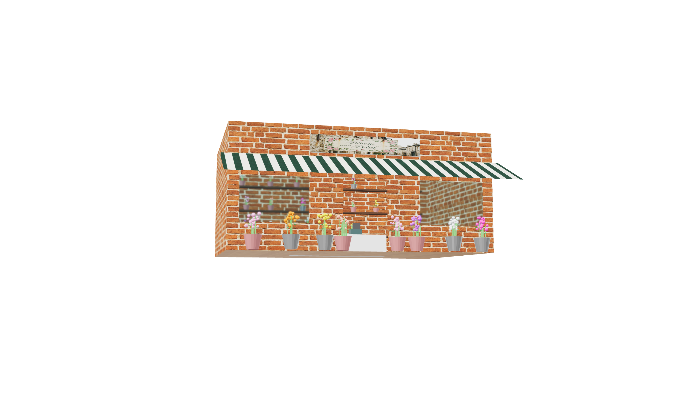

# Open Realm

**AI-Powered Open World — Every interaction is real.**

Open Realm is a browser-based 3D open world game where every NPC conversation, every object interaction, and every building is powered by AI in real time. There are no scripted dialogues, no pre-built levels — the world emerges dynamically as you explore and interact.

<p align="center">
  
</p>

## The Vision

What if every character in a game was truly intelligent? What if you could ask an NPC to build you a house, and it actually appeared? What if the world responded to your words as naturally as a conversation with a friend?

Open Realm is an experiment in making that real. We combine:

- **Gemini 3.1 Pro** for NPC dialogue, world events, and procedural code generation
- **Blender MCP** for real-time 3D asset creation — buildings, objects, and props generated on the fly
- **Google Lyria** for adaptive music that responds to your environment
- **Three.js** for browser-native 3D rendering with no install required

The result: an infinite, procedurally generated city where you can talk to anyone, ask for anything, and watch the world reshape itself around you.

## Features

### AI-Powered NPCs
Every NPC has a unique personality, occupation, and backstory. Conversations are fully dynamic — ask them anything, and they respond in character. NPCs can follow you, give you items, run away, or trigger world events based on your conversation.

### Real-Time 3D Asset Generation
Ask an NPC to build something and watch it appear. The pipeline uses Gemini to generate Blender Python code, executes it via Blender MCP, validates the result with vision AI, and exports GLB models directly into the game world.

### Voice Input
Talk to NPCs using your microphone via the Web Speech API. NPC responses are spoken back to you with AI text-to-speech.

### Procedural World
An infinite chunk-based city with buildings, roads, streetlights, parks, vehicles, and NPCs — all generated from seeded RNG. Every playthrough explores a different world.

### Adaptive Music
Background music is generated in real time by Google Lyria based on your environment and recent events.

## Controls

| Key | Action |
|-----|--------|
| WASD | Move |
| Mouse | Look around |
| SPACE | Jump |
| SHIFT | Run |
| E | Interact / Talk to NPC |
| G | Grab object |
| Click | Throw held object |
| V | Enter / exit vehicle |
| ESC | Close panel |

## Getting Started

### Prerequisites
- Python 3.8+
- A Gemini API key (set in `.env`)
- Blender with the MCP addon (optional, for asset generation)

### Setup

```bash
git clone https://github.com/Neel49/open-realm.git
cd open-realm

echo "GEMINI_API_KEY=your_key_here" > .env

# Optional: for Lyria music generation
pip install google-genai

python server.py
```

Open `http://localhost:3000` in your browser and click **ENTER WORLD**.

### Blender MCP (Optional)

For real-time 3D asset generation, install the [Blender MCP addon](https://github.com/ahujasid/blender-mcp) and have Blender running with the socket server on port 9876. Without Blender, the game still works — NPC conversations, world exploration, and all other features function normally.

## Architecture

```
open-realm/
├── index.html              # Entry point
├── server.py               # Python backend (Gemini AI, Blender MCP, Lyria music)
├── src/
│   ├── main.js             # Game loop, scene setup, input handling
│   ├── ai/                 # AI API client (chat, examine, world events)
│   ├── audio/              # Lyria music streaming + adaptive music
│   ├── entities/           # NPC, player, physics
│   ├── systems/            # Interaction, world events, event logging
│   ├── ui/                 # Chat panel, examine panel, HUD
│   └── world/              # Chunk manager, buildings, props, vehicles
└── assets/
    ├── generated/          # AI-generated 3D models (.glb)
    └── textures/           # AI-generated textures (Nano Banana)
```

## Tech Stack

- **Frontend**: Three.js, vanilla JS (ES modules), Web Speech API
- **Backend**: Python (stdlib HTTP server, no frameworks)
- **AI**: Gemini 3.1 Pro (dialogue + code gen), Nano Banana (textures), Lyria (music)
- **3D Pipeline**: Blender MCP (socket-based), GLB/glTF export
- **No build step** — just `python server.py` and go

## License

MIT
